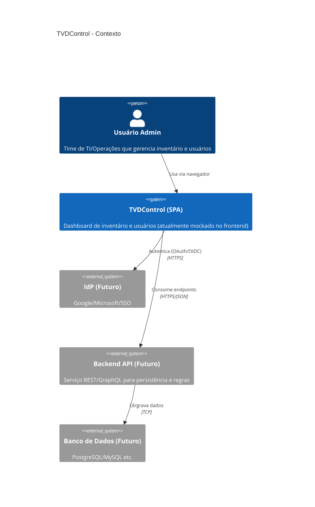
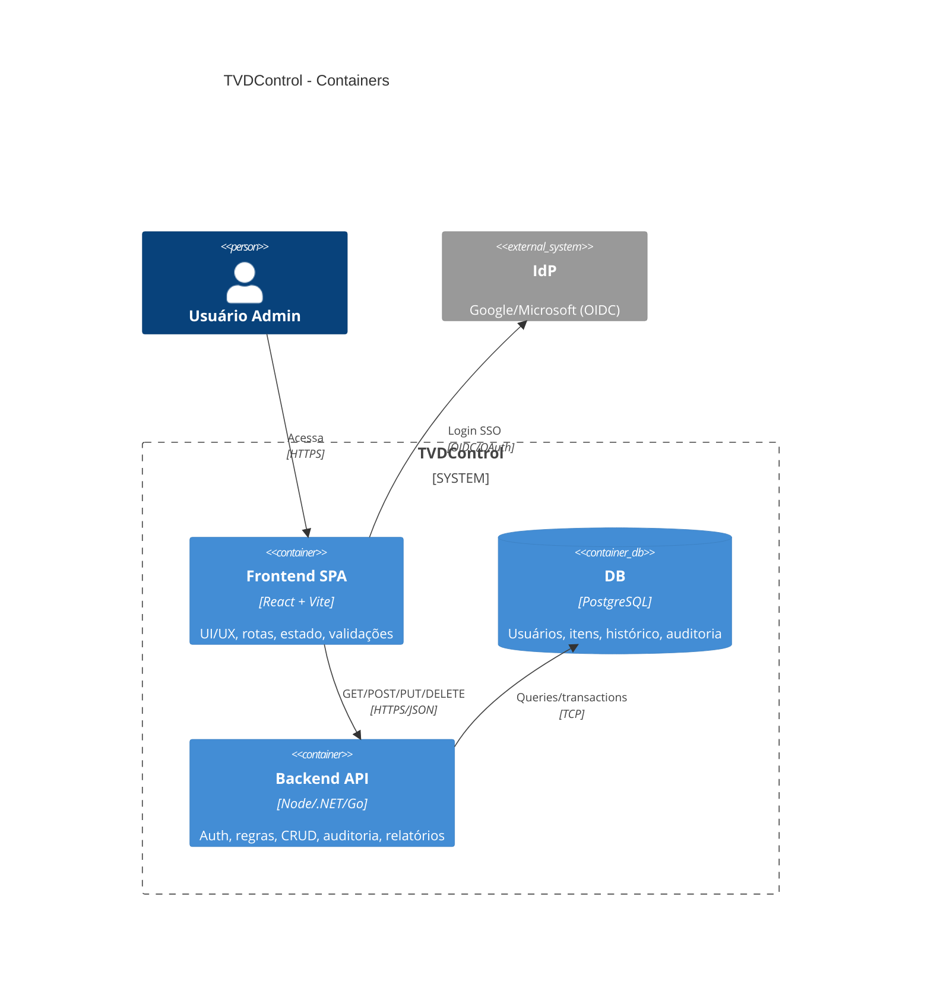
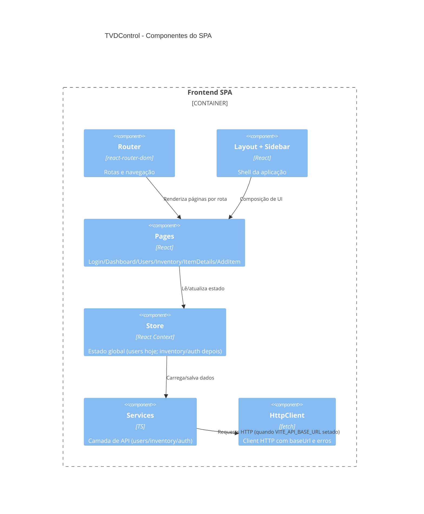
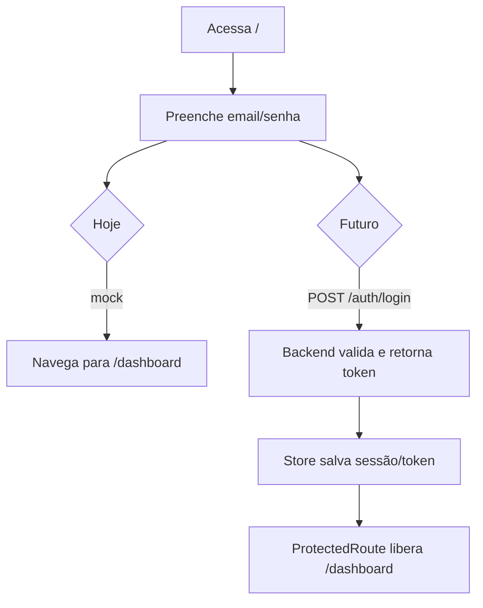
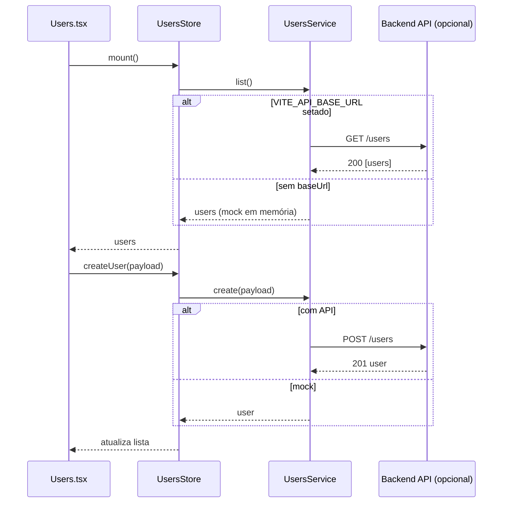

# Diagramas (C4 / Mermaid) — TVDControl

## C4 — Contexto (hoje + futuro)

## C4 — Containers (proposta de arquitetura)

## C4 — Componentes (dentro do SPA)

## Fluxos principais (Mermaid)

### Fluxo: Login (hoje vs futuro)

### Fluxo: CRUD de Usuários (com store + service)

## Proposta: “Camada de API + Store” (padrão de pastas)

Hoje eu já coloquei a base no código:
- `services/httpClient.ts`: wrapper `fetch` com `baseUrl`, JSON e erro
- `services/usersService.ts`: interface + implementação **mock** e **HTTP** (liga com `VITE_API_BASE_URL`)
- `store/UsersStore.tsx`: store de usuários (load + CRUD)
- `store/AppStoreProvider.tsx`: agregador de providers
- `vite-env.d.ts`: tipagem de `VITE_API_BASE_URL`

### Próximos “slices” sugeridos
- `services/authService.ts` + `store/AuthStore.tsx` (token, perfil, logout)
- `services/inventoryService.ts` + `store/InventoryStore.tsx` (itens, histórico, atribuições)

### Contrato de endpoints (mínimo viável)
- **Auth**
  - `POST /auth/login` → `{token, user}`
  - `POST /auth/logout`
  - `GET /me`
- **Users**
  - `GET /users`
  - `POST /users`
  - `PUT /users/:id`
  - `DELETE /users/:id`
- **Inventory**
  - `GET /items`
  - `POST /items`
  - `GET /items/:id`
  - `PUT /items/:id`
  - `DELETE /items/:id`
  - `POST /items/:id/assign` (atribuir)
  - `POST /items/:id/return` (devolver)
  - `GET /items/:id/history`

### Como ligar no backend real
No `.env.local`, definir:
- `VITE_API_BASE_URL=http://localhost:8080` (exemplo)

Sem isso, o app continua usando mock em memória.

