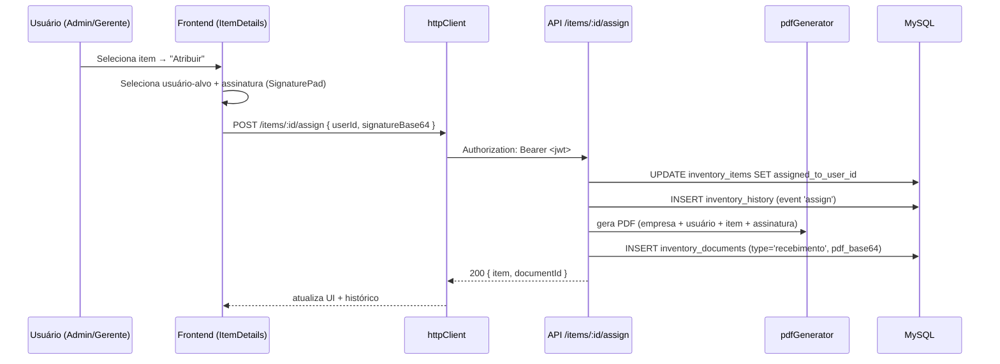
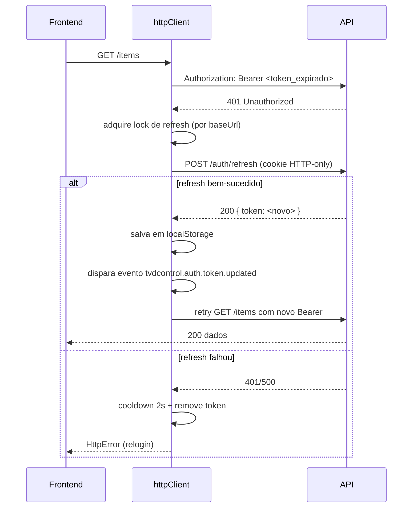

# Mapeamento do Sistema — TVDControl

> **Versão do documento**: 2.0
> **Última atualização**: 2026-04-20
> **Responsável**: Equipe TVDControl

---

## Visão geral (o que é)
- **Tipo**: aplicação **SPA** (Single Page Application) feita em **React 19 + TypeScript**.
- **Build/Dev server**: **Vite 6**.
- **UI**: **Tailwind CSS via CDN** (configurado no `index.html`), ícones Google Material Symbols, fonte Inter.
  > Observação: o pacote `tailwindcss` listado em `devDependencies` é utilizado apenas pelo `php-app/` (scripts `tailwind:watch` / `tailwind:build`). O SPA **não** consome Tailwind a partir do build do Vite.
- **Navegação**: `react-router-dom` 7 usando **`HashRouter`** (URLs com `#/rota`).
- **Backend**: **Node.js + Express 4 + TypeScript** — API REST com autenticação JWT.
- **Banco de dados**: **MySQL 8+** (mysql2); suporta conexão remota (ex.: HostGator).
- **Persistência**: dados reais via API; fallback para mocks quando a API não está configurada.
- **Geração de PDF**: `pdfkit` no backend (Termos de Responsabilidade).

### Versões principais
| Camada | Pacote | Versão |
|---|---|---|
| Frontend | `react` / `react-dom` | `^19.2.1` |
| Frontend | `react-router-dom` | `^7.10.1` |
| Frontend | `recharts` | `^3.5.1` |
| Frontend (dev) | `vite` | `^6.2.0` |
| Frontend (dev) | `typescript` | `~5.8.2` |
| Backend | `express` | `^4.18.2` |
| Backend | `mysql2` | `^3.6.5` |
| Backend | `pdfkit` | `^0.17.2` |
| Backend | `bcryptjs` | `^2.4.3` |

---

## Como rodar
- **Instalar**: `npm install` (raiz) + dependências do backend instaladas separadamente (`npm --prefix backend install`).
- **Rodar em dev (frontend + backend)**: `npm run dev` (alias de `npm run dev:full`, usa `concurrently`; frontend na porta **3000**, backend na porta **8080**).
- **Rodar só frontend**: `npm run dev:frontend`
- **Rodar só backend**: `npm run dev:backend` (usa `nodemon + ts-node`)
- **Type-check**: `npm run type-check` (frontend + backend)
- **Build**: `npm run build` (gera `dist/` frontend e `backend/dist/` backend).
- **Preview frontend**: `npm run preview`
- **Rodar produção local**: `npm start` (backend serve o frontend embutido de `dist/`)

> **Porta em dev sem `VITE_DEV_USE_LOCAL_BACKEND`**: `services/apiBaseUrl.ts` usa `http://localhost:8081` como fallback. Com `VITE_DEV_USE_LOCAL_BACKEND=true`, aponta para `http://localhost:8080` (porta padrão do backend). **Atenção a esse detalhe** ao configurar o ambiente local.

---

## Estrutura do repositório (pastas/arquivos principais)

### Entrada da aplicação
- `index.html` — HTML base + Tailwind CDN + tema custom.
- `index.tsx` — bootstrap React + `AppStoreProvider`.
- `App.tsx` — layout, rotas, proteção por autenticação e role.

### Páginas (telas)
- `pages/Login.tsx` — Login e cadastro (tabs) com API real.
- `pages/Dashboard.tsx` — KPIs, gráfico, filtros, export CSV, alerta estoque crítico.
- `pages/Inventory.tsx` — Lista de itens, busca, filtros, paginação, exclusão.
- `pages/ItemDetails.tsx` — Detalhe do item, edição, atribuir/devolver, histórico.
- `pages/AddItem.tsx` — Formulário de adicionar item com validação e upload de foto.
- `pages/Users.tsx` — Lista de usuários, drawer de detalhes, editar/criar/excluir (Administrador e Gerente).
- `pages/AddUser.tsx` — Criar novo usuário (Administrador e Gerente).
- `pages/Categories.tsx` — CRUD de categorias (Administrador e Gerente).
- `pages/CompanySettings.tsx` — Configurações da empresa (nome, razão social, CNPJ, endereço) para Termos de Responsabilidade.
- `pages/Profile.tsx` — Perfil do usuário logado, editar dados, trocar senha.

### Componentes reutilizáveis
- `components/Sidebar.tsx` — Menu lateral, perfil, logout, links por role.
- `components/Dropdown.tsx` — Dropdown genérico.
- `components/PhotoUpload.tsx` — Upload e compressão de fotos (cadastro, devolução).
- `components/SignaturePad.tsx` — Canvas de assinatura para Termos de Responsabilidade.
- `pages/users/components/` — `UsersTable`, `UserDrawer`, `UserDrawerParts`, `UserDeleteModal`, `AssignItemsModal`.
- `pages/addItem/components/` — `AddItemForm`, `AddItemSuccessModal`, `AddItemCancelModal`.

### Store (estado global)
- `store/AppStoreProvider.tsx` — Composição dos providers (ordem: `Auth → Cargo → Users → Inventory`).
- `store/AuthStore.tsx` — Autenticação (user, token, login, logout).
- `store/CargoStore.tsx` — Lista de cargos/funções (alimenta o campo `jobTitle` em usuários).
- `store/InventoryStore.tsx` — Estado do inventário.
- `store/UsersStore.tsx` — Estado dos usuários.

### Services (camada de dados)
- `services/apiBaseUrl.ts` — URL base da API (`VITE_API_BASE_URL` / `VITE_DEV_USE_LOCAL_BACKEND`).
- `services/httpClient.ts` — Cliente HTTP com token, **refresh automático em 401**, tratamento de erros, lock para evitar refresh concorrente, cooldown de 2 s após falha.
- `services/authService.ts` — Login, registro, refresh, logout, me, updateMe, changePassword.
- `services/inventoryService.ts` — CRUD itens, histórico, atribuir (com assinatura), devolver (com assinatura); fallback mock.
- `services/usersService.ts` — CRUD usuários.
- `services/categoriesService.ts` — Listar, criar, excluir categorias; fallback mock.
- `services/companySettingsService.ts` — Obter e atualizar configurações da empresa.
- `services/documentsService.ts` — Listar documentos do item e download de PDF.
- `services/cargoService.ts` — Listar cargos/funções.

### Utils
- `utils/permissions.ts`:
  - `isValidRole`, `isSystemUser`, `isProductUser`, `isAdministrator`
  - `canCreate`, `canRead`, `canUpdate`, `canDelete` → **todos retornam `isSystemUser`** (Administrador **e** Gerente)
  - `canManageUsers` → **Administrador apenas** (controle total sobre qualquer usuário)
  - `canCreateProductUser` → `isSystemUser` (Admin e Gerente)
  - `canEditProductUser(current, target)` → Admin sempre; Gerente só se `target.role === 'Usuario'`
  - `canDeleteUser(current, target)` → Admin sempre; Gerente só se `target.role === 'Usuario'`
  - `canListUsers` → `isSystemUser` (Admin e Gerente)
  - `canManageCategories` → `isSystemUser` (Admin e Gerente)

### Tipos (`types.ts`)
- Tipo `UserRole = 'Administrador' | 'Gerente' | 'Usuario'`
- Constantes `SYSTEM_ROLES = ['Administrador', 'Gerente']` e `PRODUCT_ROLES = ['Usuario']`
- Interface `User`: `id`, `name`, `email`, `phone?`, `cpf?`, `role`, `department`, `jobTitle?`, `avatar`, `itemsCount`, `status` (`active` | `inactive`).
- Interface `InventoryItem`: inclui `phoneNumber?` (para Celulares > Smartphone), `photoMain?`, `photoMain2?`, `sku?`, `asset_tag` (no banco), `purchasePrice?`.
- Tipo `InventoryHistoryEvent`: `returnPhoto?`, `returnPhoto2?`, `returnNotes?`, `returnItems?`.
- Enum `ItemStatus`: `Available='available'`, `InUse='in_use'`, `Maintenance='maintenance'`, `Retired='retired'`.

### Backend (`backend/`)
- `backend/src/index.ts` — Inicia o servidor Express (porta 8080 por padrão, configurável via `PORT`).
- `backend/src/app.ts` — App Express (rotas, CORS, **migrations automáticas no boot**); exporta `getApp()` para Vercel.
- `backend/src/config.ts` — Porta, CORS, DB, JWT.
- `backend/src/db.ts` — Pool MySQL.
- `backend/src/routes/auth.ts` — Login, register, refresh, logout, me, updateMe, changePassword.
- `backend/src/routes/users.ts` — CRUD usuários (GET acessível a Admin e Gerente para atribuição).
- `backend/src/routes/items.ts` — CRUD itens, histórico, atribuir (gera PDF), devolver (gera PDF).
- `backend/src/routes/categories.ts` — CRUD categorias.
- `backend/src/routes/companySettings.ts` — GET/PUT configurações da empresa.
- `backend/src/routes/documents.ts` — Download de PDF dos Termos de Responsabilidade.
- `backend/src/routes/cargos.ts` — GET lista de cargos/funções (requer autenticação).
- `backend/src/utils/` — `auth`, `password`, `permissions`, `token`, `uuid`, **`pdfGenerator`** (gera PDF de recebimento e devolução).
- `backend/db/schema.sql` — Schema canônico (criação idempotente com `CREATE TABLE IF NOT EXISTS`).
- `backend/db/migrations/` — 001–010 (ver tabela em [Migrations](#migrations)).
- `backend/db/seed_admin.sql` — Seed inicial do usuário Administrador.

### Deploy Vercel
- `api/[[...path]].ts` — Serverless handler que encaminha `/api/*` para o Express.
- `vercel.json` — Build (frontend + backend), rewrites SPA, output.
- `VERCEL.md` — Instruções de deploy e variáveis de ambiente.

### Outros
- `vite.config.ts` — Porta 3000, alias `@`, env (Gemini — ver observação abaixo).
- `metadata.json` — Metadados do app.
- `index.css` — Placeholder (Tailwind via CDN).
- `php-app/` — Aplicação PHP paralela (**legada/alternativa**, não utilizada pela SPA).

---

## Rotas (mapa de navegação)

| Rota | Componente | Proteção |
|------|------------|----------|
| `/` | Login | Pública |
| `/dashboard` | Dashboard | Autenticado |
| `/inventory` | Inventory | Autenticado |
| `/users` | Users | **Administrador, Gerente** |
| `/users/add` | AddUser | **Administrador, Gerente** |
| `/categories` | Categories | Administrador, Gerente |
| `/company-settings` | CompanySettings | Administrador, Gerente |
| `/profile` | Profile | Autenticado |
| `/item/:id` | ItemDetails | Autenticado |
| `/items/add` | AddItem | **Administrador, Gerente** |

> **Correção frente à versão anterior deste documento**: `/users`, `/users/add` e `/items/add` exigem `RequireRole(['Administrador','Gerente'])` — conforme `App.tsx` (linhas 103, 104, 109). Gerente pode criar e editar usuários, mas apenas usuários com role `Usuario` (ver `canEditProductUser`).

### Layout global
- O `Layout` **omite Sidebar** quando a rota é `/` (login).
- Para as demais rotas: `Sidebar` (responsivo), header mobile, conteúdo.
- `Protected` — redireciona para `/` se não autenticado.
- `RequireRole` — redireciona para `/dashboard` com mensagem de flash (`'Sem permissão para acessar esta área'`) se a role não for permitida.
- **Lazy loading**: todas as páginas (exceto `Login`) são carregadas via `React.lazy` com fallback "Carregando...".

---

## API REST (backend)

### Autenticação (`/auth`)
- `POST /auth/login` — Login (email, senha); retorna `user + token`; define cookie de refresh.
- `POST /auth/register` — Cadastro; retorna `user + token`.
- `POST /auth/refresh` — Renova access token via cookie de refresh.
- `POST /auth/logout` — Invalida refresh token (remove `refresh_token_hash` do usuário).
- `GET /auth/me` — Dados do usuário logado (requer token).
- `PUT /auth/me` — Atualizar perfil (nome, departamento, avatar, jobTitle).
- `PUT /auth/me/password` — Trocar senha.

### Usuários (`/users`)
- `GET /users` — Lista (filtros, ordenação).
- `GET /users/:id` — Detalhe.
- `POST /users` — Criar.
- `PUT /users/:id` — Atualizar.
- `DELETE /users/:id` — Excluir.

### Itens (`/items`)
- `GET /items` — Lista (filtros).
- `GET /items/:id` — Detalhe.
- `GET /items/meta/next-asset-tag` — Próxima tag de ativo.
- `POST /items` — Criar.
- `PUT /items/:id` — Atualizar.
- `DELETE /items/:id` — Excluir.
- `GET /items/:id/history` — Histórico do item.
- `GET /items/:id/documents` — Lista PDFs de termos (recebimento/devolução) do item.
- `POST /items/:id/assign` — Atribuir a usuário (`userId`, `signatureBase64?`); gera PDF de Termo de Recebimento.
- `POST /items/:id/return` — Devolver item (`returnPhoto`, `returnPhoto2?`, `returnNotes`, `returnItems`, `signatureBase64?`); gera PDF de Termo de Devolução.

### Configurações da Empresa (`/company-settings`)
- `GET /company-settings` — Obter dados da empresa (Admin e Gerente).
- `PUT /company-settings` — Atualizar (**apenas Administrador**).

### Documentos (`/documents`)
- `GET /documents/:id/download` — Download do PDF do termo (requer autenticação).

### Categorias (`/categories`)
- `GET /categories` — Lista.
- `POST /categories` — Criar.
- `DELETE /categories/:id` — Excluir.

### Cargos/Funções (`/cargos`)
- `GET /cargos` — Lista cargos/funções (ordenado por nome). Alimenta o campo `jobTitle` do usuário.

### Health
- `GET /health` — Health check (com teste de conexão ao banco, `SELECT 1`).

---

## Modelo de dados

### Tabelas MySQL (schema atual)

#### `users`
```sql
id CHAR(36) PRIMARY KEY,
name VARCHAR(120) NOT NULL,
email VARCHAR(190) NOT NULL UNIQUE,
password_hash VARCHAR(255) NOT NULL,
role VARCHAR(80) NOT NULL,               -- 'Administrador' | 'Gerente' | 'Usuario'
department VARCHAR(80) NOT NULL,
job_title VARCHAR(120) NULL,             -- FK lógica para cargo.name
avatar TEXT NULL,
refresh_token_hash VARCHAR(255) NULL,
refresh_token_expires_at DATETIME NULL,
status ENUM('active','inactive') DEFAULT 'active',
phone VARCHAR(30) NULL,
cpf VARCHAR(14) NULL,
internal_notes TEXT NULL,
created_at / updated_at
```

#### `inventory_items`
```sql
id, category, type, manufacturer, name, model, serial_number UNIQUE,
asset_tag UNIQUE, sku, icon,
status ENUM('available','in_use','maintenance','retired'),
assigned_to_user_id → users(id),
purchase_date, purchase_price,
warranty_end, location, specs, notes,
photo_main TEXT, photo_main_2 TEXT,      -- duas fotos de entrada
phone_number VARCHAR(20),                -- Celulares > Smartphone
created_at / updated_at
```

#### `inventory_history`
```sql
id, item_id → inventory_items(id) ON DELETE CASCADE,
actor_user_id → users(id),
event_type, color ENUM('primary','slate','success','danger'),
title, description,
return_photo, return_photo_2, return_notes, return_items,
created_at
```

#### `inventory_documents`
```sql
id, item_id → inventory_items(id) ON DELETE CASCADE,
user_id → users(id),
type ENUM('recebimento','devolucao'),
file_path VARCHAR(512),
pdf_base64 LONGTEXT NULL,                -- PDF armazenado como base64
signed_at,
actor_user_id → users(id),
history_event_id,
created_at
```

> **Nota arquitetural**: os PDFs são armazenados **no próprio banco** como `LONGTEXT` (base64). A coluna `file_path` existe por compatibilidade, mas o download é servido a partir de `pdf_base64`. Considerar migração para storage externo (S3/equivalente) em caso de crescimento significativo.

#### `categories`
```sql
id CHAR(36) PRIMARY KEY,
name VARCHAR(80) NOT NULL UNIQUE,
created_at / updated_at
```
Seed automático: `Notebook`, `Computadores`, `Celulares`, `Monitores`, `Periféricos`, `Chips`, `Acessórios`.

#### `cargo`
```sql
id CHAR(36) PRIMARY KEY,
name VARCHAR(120) NOT NULL UNIQUE,
created_at / updated_at
```
Seed automático com ~75 cargos pré-cadastrados (Executivo de Contas, Analista de marketing, Jornalista, Designer etc.).

#### `company_settings`
```sql
id, name, legal_name, address, city, state, zip, cnpj,
created_at / updated_at
```
Uma única linha por instalação; dados usados nos PDFs dos Termos.

### Migrations

| # | Arquivo | O que faz |
|---|---------|-----------|
| 001 | `001_add_password_hash.sql` | Adiciona `password_hash` a `users` |
| 002 | `002_update_roles.sql` | Normaliza valores de `role` |
| 003 | `003_add_refresh_token_fields.sql` | Campos de refresh token em `users` |
| 004 | `004_add_item_photos.sql` | Coluna `photo_main` |
| 005 | `005_add_return_notes_items.sql` + `005_manual_add_return_columns.sql` | Colunas de devolução em `inventory_history` |
| 006 | `006_add_company_settings_and_documents.sql` | Tabelas `company_settings` e `inventory_documents` |
| 007 | `007_add_user_cpf.sql` | Coluna `cpf` em `users` |
| 008 | `008_create_cargo_table.sql` | Tabela `cargo` + seed de cargos |
| 009 | `009_add_item_phone_number.sql` | Coluna `phone_number` em `inventory_items` |
| 010 | `010_add_second_photos.sql` | Colunas `photo_main_2` e `return_photo_2` |

> **Migrations automáticas no boot**: `backend/src/app.ts → getApp()` executa funções `ensure*` (`ensureRefreshTokenColumns`, `ensureUserCpfColumn`, `ensureUserJobTitleColumn`, `ensureItemPhotoColumns`, `ensureCompanySettingsTable`, `ensureInventoryDocumentsTable`, `ensureCategoriesTableAndSeed`, `ensureCargoTable`) que criam tabelas/colunas faltantes de forma idempotente. Não há ferramenta dedicada de migration (knex/typeorm) — o controle é manual.

### Tipos TypeScript (resumo)

| Interface | Campos principais |
|---|---|
| `User` | `id`, `name`, `email`, `phone?`, `cpf?`, `role`, `department`, `jobTitle?`, `avatar`, `itemsCount`, `status` |
| `CompanySettings` | `id`, `name`, `legalName`, `address`, `city`, `state`, `zip`, `cnpj` |
| `InventoryDocument` | `id`, `itemId`, `userId`, `type`, `filePath`, `pdfBase64`, `signedAt`, `actorUserId`, `historyEventId` |
| `InventoryItem` | `id`, `serialNumber`, `model`, `manufacturer`, `category`, `status`, `assignedTo?`, `purchaseDate`, `warrantyEnd`, `location?`, `specs?`, `notes?`, `photoMain?`, `photoMain2?`, `phoneNumber?`, `sku?`, `icon?`, `purchasePrice?` |
| `Category` | `id`, `name`, `createdAt`, `updatedAt` |
| `Cargo` | `id`, `name` |

---

## Fluxos principais

### 1) Login / Cadastro
- **Tela**: `Login.tsx`
- Login com email e senha; cadastro com nome, email, senha.
- JWT (access token persistido em **`localStorage`** sob a chave `tvdcontrol.auth.token`) + refresh token em cookie HTTP-only.
- "Lembrar me por 30 dias" prolonga o refresh token.
- Redireciona para rota de origem após login ou para `/dashboard`.

### 2) Dashboard
- Dados da API (`inventoryService`) ou mocks.
- KPIs, gráfico Recharts, busca/filtros, export CSV.
- Alerta de estoque crítico (qty ≤ 2).
- Navega para `/item/:id` ao clicar em item crítico.

### 3) Inventário
- Lista da API com busca, filtros, paginação.
- Exclusão com modal de confirmação.
- Navega para `/item/:id` ao clicar na linha.
- Botões: ver, editar, excluir.

### 4) Detalhe do Item
- Visualização/edição; atribuir usuário / devolver item.
- **Modal de atribuição**: seleção de usuário (role `Usuario`), assinatura opcional; gera PDF de Termo de Recebimento.
- **Modal de devolução**: checklist de itens, observação, **até duas fotos**, assinatura opcional; gera PDF de Termo de Devolução.
- **Histórico completo** (timeline) com downloads dos PDFs dos termos.
- Histórico exibe nome do usuário (não UUID) em eventos de atribuição.

### 5) Adicionar Item
- Formulário com validação; categorias da API ou mock.
- Campo `phone_number` aparece quando categoria/tipo é Celulares > Smartphone.
- Suporte a duas fotos de entrada (`photoMain`, `photoMain2`).
- Modal de sucesso; redireciona para o item criado.
- Modal de cancelamento se houver dados preenchidos.

### 6) Usuários
- Lista, busca, drawer de detalhes.
- Editar, criar, excluir (modal de confirmação).
- Ativar/desativar; atribuir itens (`AssignItemsModal`).
- **Administrador**: CRUD total (qualquer role).
- **Gerente**: lista todos, cria/edita/**exclui apenas usuários com role `Usuario`** (`canEditProductUser` / `canDeleteUser`).
- Excluir Admin/Gerente: apenas Administrador.

### 7) Categorias
- Lista, criar, excluir.
- Administrador e Gerente (`canManageCategories`).

### 8) Configurações da Empresa
- Nome, razão social, CNPJ, endereço (cidade, estado, CEP).
- Dados usados nos Termos de Responsabilidade (PDF).
- **Administrador edita**; Administrador e Gerente podem visualizar.
- Link "Empresa" na sidebar.

### 9) Termos de Responsabilidade (PDF)
- **Recebimento**: ao atribuir item, gera PDF com dados da empresa, usuário (nome, departamento, CPF, cargo), item e condições; assinatura opcional.
- **Devolução**: ao devolver item, gera PDF com dados, checklist, observações, fotos; assinatura opcional.
- PDFs armazenados em `inventory_documents.pdf_base64` (LONGTEXT).
- Download no modal de Histórico do item (botões por documento) via `GET /documents/:id/download`.

### 10) Perfil
- Editar nome, departamento, cargo (`jobTitle`), avatar.
- Trocar senha.
- Dados do usuário logado.

### Diagrama — fluxo de atribuição com geração de PDF



### Diagrama — refresh automático de token



---

## Autenticação e segurança
- **Access token (JWT)**: persistido em `localStorage` (chave `tvdcontrol.auth.token`). Enviado via `Authorization: Bearer`. Sincronizado entre abas por meio do `CustomEvent('tvdcontrol.auth.token.updated')`.
- **Refresh token**: em cookie HTTP-only; usado em `/auth/refresh` para renovar o access token.
- **Lock de refresh concorrente**: `refreshLocks` no `httpClient` evita múltiplos refresh simultâneos por `baseUrl`.
- **Cooldown de refresh**: após falha, aguarda 2 s antes de tentar novamente (evita loop).
- **Proteção de rotas**: `Protected` (autenticado) e `RequireRole` (role mínima).
- **Permissões**:
  - `canCreate`, `canRead`, `canUpdate`, `canDelete`, `canListUsers`, `canManageCategories` → **Administrador e Gerente** (`isSystemUser`).
  - `canManageUsers` → **Administrador apenas** (editar/excluir outros Admin/Gerente).
  - `canEditProductUser` → Admin sempre; Gerente só edita `target.role === 'Usuario'`.
  - `canDeleteUser(current, target)` → Admin sempre; Gerente só exclui `target.role === 'Usuario'`.
- **Mensagens amigáveis** (`getFriendlyErrorMessage`): `401 login → 'Usuário ou senha invalido'`, `409 register → 'Email já cadastrado'`, `403 → 'Sem permissão'`, `404`, `5xx`.
- **Gerente** pode listar usuários e atribuir itens a usuários com role `Usuario`.

### Pontos de atenção (segurança)
- **Access token em `localStorage`** é vulnerável a XSS. Mitigar com CSP, sanitização e preferência futura por armazenamento em memória + cookie HTTP-only também para access token.
- **Sem rate limiting** no `/auth/login` — considerar `express-rate-limit` para proteção contra brute-force.
- **Sem validação declarativa** (Zod/Joi/express-validator) nas rotas; validação é manual/tipada.
- **Sem logs estruturados** (Winston/Pino) ou observabilidade (Sentry).

---

## Variáveis de ambiente (consolidado)

### Frontend (`.env` / `.env.local` na raiz)
| Variável | Uso | Exemplo |
|---|---|---|
| `VITE_API_BASE_URL` | URL base da API em produção | `https://api.tvdcontrol.com` |
| `VITE_DEV_USE_LOCAL_BACKEND` | Em dev, aponta para `http://localhost:8080` ao invés de `:8081` | `true` |
| `GEMINI_API_KEY` | Configurado no `vite.config.ts`, **atualmente não utilizado**. Remover ou implementar integração. | — |

### Backend (`backend/.env`)
| Variável | Uso | Padrão |
|---|---|---|
| `PORT` | Porta do servidor Express | `8080` |
| `CORS_ORIGIN` | Origem permitida (inclui domínio Vercel automaticamente em deploy) | — |
| `DB_HOST` | Host MySQL | — |
| `DB_PORT` | Porta MySQL | `3306` |
| `DB_USER` | Usuário MySQL | — |
| `DB_PASSWORD` | Senha MySQL | — |
| `DB_NAME` | Nome do banco | — |
| `JWT_SECRET` | Segredo para assinar JWT | **obrigatório** |
| `JWT_EXPIRES_IN` | Expiração do access token | `15m` / `1h` |
| `JWT_REFRESH_EXPIRES_IN` | Expiração do refresh token | `7d` / `30d` |
| `JWT_REFRESH_COOKIE` | Nome do cookie do refresh token | — |
| `NODE_ENV` | Em `production` oculta detalhes de erro | `development` |

---

## Deploy

### Local (produção)
```bash
npm run build
npm start
```
Backend serve o frontend em `dist/` (detectado automaticamente em `app.ts`).

### Vercel
- Frontend estático + API como Serverless Function em `/api/*`.
- Variáveis obrigatórias: `VITE_API_BASE_URL`, `JWT_SECRET`, `DB_HOST`, `DB_USER`, `DB_PASSWORD`, `DB_NAME`.
- MySQL externo (ex.: HostGator); habilitar acesso remoto no painel da hospedagem.
- Ver `VERCEL.md` para detalhes.

---

## Troubleshooting

| Problema | Possível causa | Resolução |
|---|---|---|
| Frontend em dev retorna 404 em chamadas de API | `VITE_DEV_USE_LOCAL_BACKEND` não setado e backend roda na 8080 | Setar `VITE_DEV_USE_LOCAL_BACKEND=true` no `.env.local` **ou** rodar backend na 8081 |
| Loop de 401 após login | Refresh falhou / cookie bloqueado | Verificar se API e frontend estão no mesmo domínio (ou CORS com `credentials: true`); conferir `SameSite`/`Secure` do cookie em produção |
| `HTTP 500` em `/items/:id/assign` sem stack no log | `NODE_ENV=production` | Setar `NODE_ENV=development` temporariamente para ver `err.stack` |
| PDF em branco ao baixar | `pdf_base64` vazio (migration não rodou) | Reiniciar backend para disparar `ensureInventoryDocumentsTable`; ou rodar migração 006 manualmente |
| MySQL recusa conexão remota | ACL da hospedagem | Liberar IP da Vercel/servidor no painel da hospedagem |
| Sessão cai ao trocar de aba | `localStorage` inconsistente entre abas | Já tratado via `CustomEvent('tvdcontrol.auth.token.updated')`; verificar se listener está ativo |
| Gerente não consegue editar Admin | Regra esperada (`canEditProductUser`) | Somente Administrador edita outros Admin/Gerente |
| Gerente vê botão de excluir apenas em alguns usuários | Regra esperada (`canDeleteUser`) | Gerente só pode excluir usuários com role `Usuario` |
| Sidebar some em `/` | Comportamento esperado do `Layout` | Login não mostra Sidebar |

---

## Glossário

| Termo | Significado |
|---|---|
| **Administrador** (`role='Administrador'`) | Usuário de sistema com acesso total, único que pode gerenciar outros Admins/Gerentes |
| **Gerente** (`role='Gerente'`) | Usuário de sistema com permissões CRUD em itens, categorias, empresa e sobre usuários com role `Usuario` |
| **Usuario** / "Produto/Inventário" (`role='Usuario'`) | Usuário que recebe itens; **não** acessa áreas administrativas. O texto "Produto/Inventário" é um **rótulo descritivo** para a role `Usuario` |
| **Cargo / Função** | Entrada na tabela `cargo`; preenche o campo `jobTitle` do usuário |
| **Termo de Recebimento** | PDF gerado ao atribuir item a um usuário |
| **Termo de Devolução** | PDF gerado ao devolver item (`type='devolucao'`) |
| **Asset Tag** | Identificador único de ativo (`inventory_items.asset_tag`) |
| **`isSystemUser`** | Função utilitária: retorna `true` para Administrador **ou** Gerente |
| **`isProductUser`** | Função utilitária: retorna `true` apenas para role `Usuario` |

---

## Pontos para evolução

- [ ] **Tailwind**: migrar do CDN para build (PostCSS/CLI) para produção — reduzir payload CSS e remover warning do console.
- [ ] **HashRouter → BrowserRouter**: usar domínio próprio com suporte a rewrites (Vercel já suporta).
- [ ] **PDFs em `pdf_base64` (LONGTEXT)**: migrar para storage externo (S3, Vercel Blob) conforme volume crescer; `file_path` já existe para isso.
- [ ] **Rate limiting** em `/auth/login` e `/auth/register`.
- [ ] **Validação declarativa** (Zod) nas rotas.
- [ ] **Logs estruturados** (Pino) + integração com Sentry.
- [ ] **Testes automatizados** (Vitest + Testing Library no frontend, Jest/Vitest + supertest no backend).
- [ ] **CI/CD**: GitHub Actions para type-check + build.
- [ ] **Gemini API**: remover a configuração do `vite.config.ts` se não houver roadmap; ou implementar feature.
- [ ] **Decidir sobre `php-app/`**: manter como legado documentado ou remover do repositório.
- [ ] **Migration tool dedicada** (knex/typeorm/drizzle) no lugar dos blocos `ensure*` em `app.ts`.

---

## Funcionalidades recentes

| Funcionalidade | Descrição |
|----------------|-----------|
| **Configurações da Empresa** | Tela para cadastro de nome, razão social, CNPJ, endereço usados nos PDFs |
| **CPF opcional** | Campo `cpf` em usuários; exibido nos Termos quando preenchido |
| **Assinatura (canvas)** | `SignaturePad` permite desenhar assinatura; opcional em atribuição e devolução |
| **PDF de Recebimento** | Gerado ao atribuir; inclui termo completo e assinatura (se fornecida) |
| **PDF de Devolução** | Gerado ao devolver; inclui checklist, observações, fotos e assinatura |
| **Download no Histórico** | Botões para baixar PDFs no modal de Histórico do item |
| **Gerente pode atribuir** | Gerente lista usuários e atribui itens a usuários `Usuario` |
| **Cargos/Funções pré-cadastrados** | Tabela `cargo` com ~75 cargos; campo `jobTitle` em usuários |
| **Segunda foto (entrada e devolução)** | `photo_main_2` e `return_photo_2` para fotos adicionais |
| **Telefone em Smartphones** | Campo `phone_number` em `inventory_items` para Celulares > Smartphone |
| **Refresh automático com lock** | `httpClient` trata 401, faz refresh automático com lock e cooldown |
